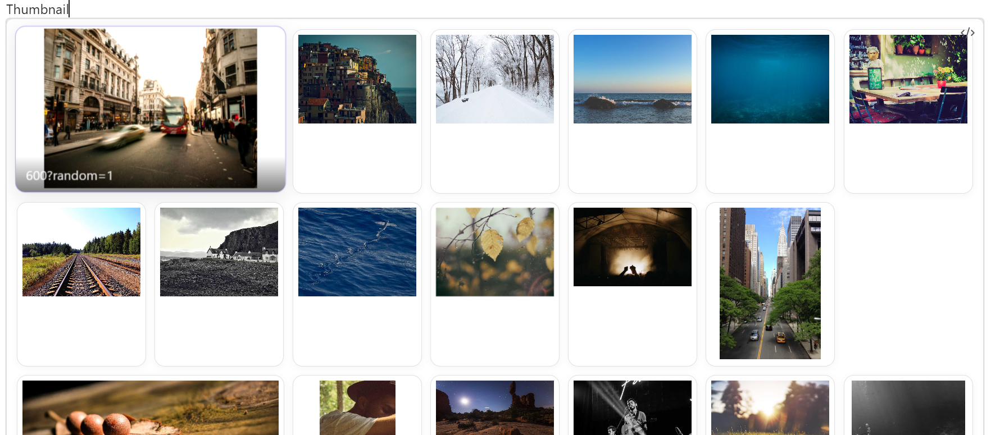
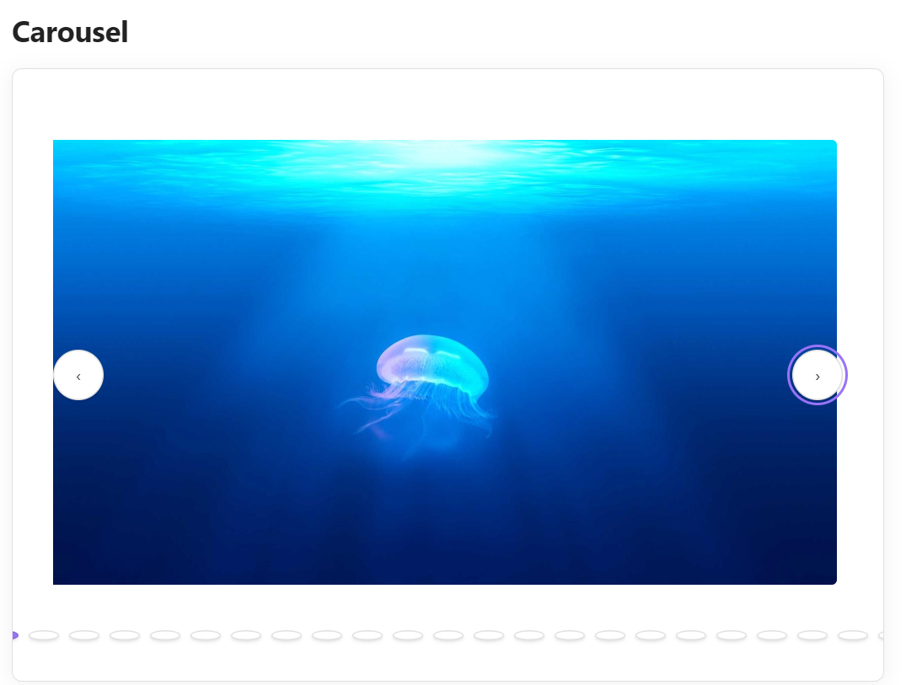
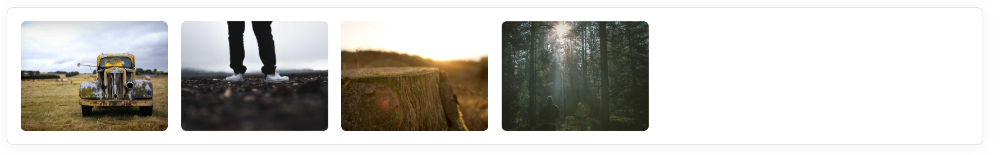

# Gallery View

Create interactive image galleries in your Obsidian notes using simple code blocks. Display images from your vault folders with thumbnail grids and click-to-expand modal viewing.

 

## Features

- **Thumbnail galleries** — Display images in responsive grid layouts
- **Modal viewer** — Click thumbnails to view full-size images
- **Multiple Sources** — Load images from local folders, external URLs, or Immich shared links
- **Simple syntax** — Easy `obs-gallery` code blocks with `sources` + `view` schema
- **Responsive design** — Works on desktop and mobile
- **Performance** — Lazy loading for large image collections
- **Clean styling** — Integrates seamlessly with Obsidian themes
- **Error handling** — Graceful fallbacks for missing paths

## Quick start

### Installation

1. Download the plugin files (`main.js`, `manifest.json`, `styles.css`)
2. Create folder: `YourVault/.obsidian/plugins/gallery-view/`
3. Copy files to the plugin folder
4. Enable "Gallery View" in Obsidian Settings → Community Plugins

### Basic Usage

Create galleries in your notes using code blocks:

````markdown
```obs-gallery
sources:
  - type: local
    path: Images/Screenshots
view:
  type: thumbnail
```
````

> [!NOTE]
> The plugin fully supports the legacy v1 syntax (e.g., `path: Images/Screenshots`) for backward compatibility, but the v2 nested `sources` schema is preferred.

## Usage examples

### Folder Gallery
Display all images from a folder:
````markdown
```obs-gallery
sources:
  - type: local
    path: Photos/Vacation2024
view:
  type: thumbnail
```
````



### Carousel View
Horizontal scrolling carousel with controls:
````markdown
```obs-gallery
sources:
  - type: local
    path: Images/Screenshots
view:
  type: carousel
```
````



### Masonry Grid
Pinterest-style layout with variable heights:
````markdown
```obs-gallery
sources:
  - type: local
    path: Projects/WebDev
    recursive: true
view:
  type: grid
```
````


### With Immich Shared Links
Include images directly from an Immich public share:
````markdown
```obs-gallery
sources:
  - type: immich-share
    url: https://photos.example.com/share/abc1234
view:
  type: grid
```
````

### With External Images
Include remote images (requires enabling in settings):
````markdown
```obs-gallery
sources:
  - type: external
    urls:
      - https://picsum.photos/800/600?random=1
      - https://picsum.photos/800/600?random=2
      - https://picsum.photos/800/600?random=3
      - https://picsum.photos/800/600?random=4
view:
  type: grid
```
````



## Documentation

For full details on configuring the plugin, usage examples, and available settings, please refer to the [Gallery View documentation](https://mkshp-dev.github.io/obsidian-gallery-plugin/).

## Supported formats

- **JPEG** (`.jpg`, `.jpeg`)
- **PNG** (`.png`)
- **GIF** (`.gif`)
- **WebP** (`.webp`)

## Interface

### Thumbnail Grid
- Responsive grid layout adapts to screen size
- Hover effects for better interactivity
- Lazy loading for performance

### Modal Viewer
- Full-size image display
- Multiple ways to close:
  - Click the **×** button
  - Press **Escape** key
  - Click outside the image
- Image name displayed at bottom

## Development

### Building from Source

```bash
# Install dependencies
npm install

# Development build with watching
npm run dev

# Production build
npm run build

# Simple build (MVP version)
npm run build-mvp
```

### Project Structure

```
obsidian-gallery-plugin/
├── main.ts              # Main plugin code
├── main.js              # Compiled plugin
├── manifest.json        # Plugin metadata
├── styles.css           # Gallery styling
├── package.json         # Dependencies
├── tsconfig.json        # TypeScript config
└── src/                 # Advanced architecture (future)
    ├── models/          # Data models
    ├── views/           # View components
    ├── services/        # Core services
    └── processors/      # Content processing
```

## Troubleshooting

### Gallery Not Appearing
- Check that the path exists and has correct case sensitivity
- Verify images are in supported formats
- Use exact folder names (e.g., `Images` not `images` if capitalized)

### Modal Not Opening
- Ensure `styles.css` is properly loaded
- Check browser console for JavaScript errors
- Try refreshing Obsidian or restarting the plugin

### Path Issues
- Use relative paths from vault root
- Don't include leading or trailing slashes
- Example: `Images/Photos` not `/Images/Photos/`

### Performance with Many Images
- Plugin uses lazy loading automatically
- Consider organizing large collections into subfolders
- Modal loads full-resolution images on demand

Contributions are welcome! Please feel free to:

- Share usage examples and feedback
- Help with documentation

### Development Setup

1. Clone the repository
2. Run `npm install` to install dependencies
3. Use `npm run dev` for development with auto-rebuilding
4. Test in your Obsidian vault

## License

MIT License — see [LICENSE](./LICENSE) for details.

## Acknowledgments

- Built for the [Obsidian](https://obsidian.md) community

## Support
If this project helps your workflow, consider supporting its development with a ☕

<a href="https://www.buymeacoffee.com/mkshp" target="_blank">
  
</a>

<br/>

<a href="https://github.com/sponsors/mkshp-dev" target="_blank">
  
</a>

- **Bug reports**: [GitHub Issues](../../issues)
- **Feature requests**: [GitHub Discussions](../../discussions)
- **Documentation**: [Plugin docs](https://mkshp-dev.github.io/obsidian-gallery-plugin)